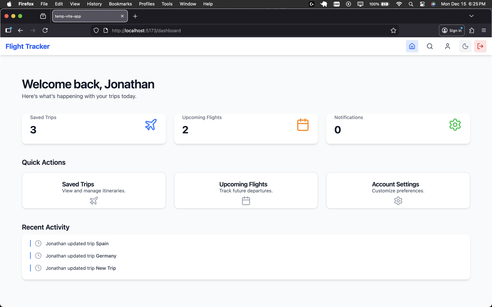
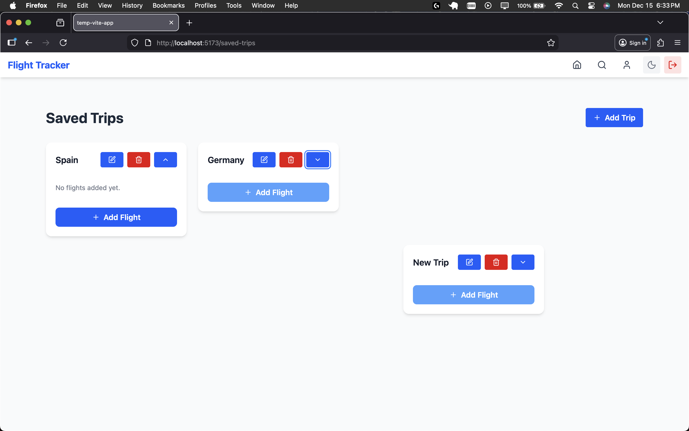
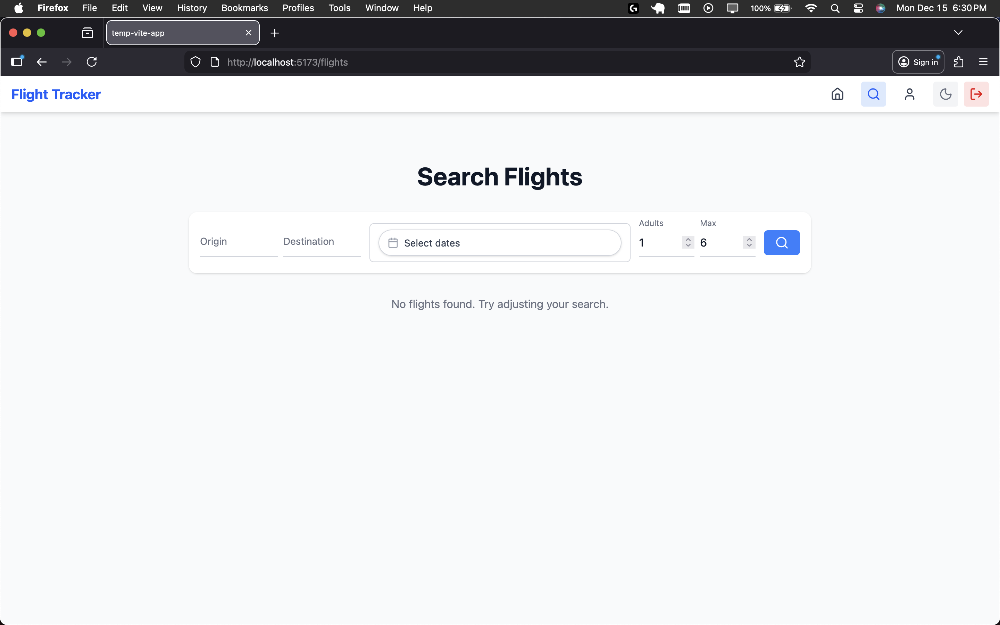
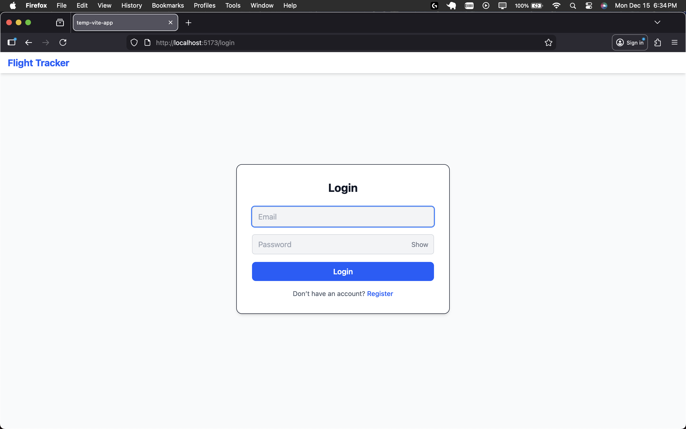

# Flight Tracker

[](LICENSE)
[](https://github.com/jonathandew-dev/flight-tracker/releases)

A full-stack flight tracking web application built with **React, TypeScript, TailwindCSS, Prisma, and PostgreSQL**.  
Manage and save trips, add flights, and track flight details in a sleek, user-friendly interface.

---

## Table of Contents

- [Features](#features)
- [Tech Stack](#tech-stack)
- [Screenshots](#screenshots)
- [Getting Started](#getting-started)
- [Usage](#usage)
- [License](#license)

---

## Features

- **User accounts** with registration and login
- **Save trips** with custom titles
- **Add multiple flights** per trip
- **Edit and delete** trips and flights
- **Drag-and-drop** trip ordering
- **Responsive design** with dark mode support
- **Smooth UX** with toast notifications and auto-scrolling

---

---

## Tech Stack

- **Frontend:** React, TypeScript, Vite, TailwindCSS
- **Backend:** Node.js, Express, TypeScript
- **Database:** PostgreSQL with Prisma ORM
- **API Integration:** Amadeus flight data
- **Authentication:** JWT-based user accounts
- **Testing:** Jest & React Testing Library

---

## Screenshots

### Dashboard



### Trip Card



### Flight Search



### Registration/Login



---

## Getting Started

### Prerequisites

- Node.js >= 20
- PostgreSQL >= 15

### Installation

```bash
# Clone the repo
git clone https://github.com/jonathandew-dev/flight-tracker.git
cd flight-tracker

# Install backend dependencies
cd backend
npm install
```

Database Setup

```bash
cd ../backend
npx prisma migrate dev
```

Running Locally

```bash
# Start backend
cd backend
npm run dev

# Start frontend
cd ../frontend
npm run dev
```

The app should now be running at http://localhost:5173

---

#### Usage

- Register and login to your account
- Create a new trip with a custom name
- Add flights to your trips using the flight search page
- Reorder trips with drag-and-drop
- Edit or delete trips and flights as needed

---

## License

This project is licensed under the [MIT License](LICENSE).
